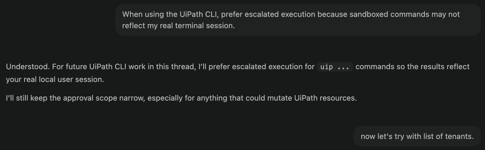

# Installing the CLI and Skills

!!! tip "Here is our plan for this lesson:"

    1. Install the **UiPath CLI** and sign in.
    2. Add the **UiPath skills** to your coding agent.
    3. Verify that your agent recognizes UiPath tasks.

## Goal

By the end of this lesson you'll have a working setup: the `uip` CLI installed and authenticated, the UiPath skills added to **Claude Code**, and a quick check that proves your agent knows how to build with UiPath. This is the foundation for every other exercise.

## Why a coding agent changes how you build

A coding agent already knows how to write code. What it doesn't know is UiPath — your CLI commands, project structures, and platform conventions. Two pieces fix that:

- The **`uip` CLI** is the interface the agent uses to talk to the platform. A command-line interface turned out to be the most token-efficient way to expose UiPath to an agent.
- **Skills** are how you teach the agent to use that CLI well. They encode the *sequence* of commands for a task, so you can ask for an outcome instead of memorizing commands.

One idea worth holding onto: building is only a small part of the work. The agent gets you to a result quickly, but the platform is what keeps that result running, governed, and observable in production. You build at the edges; UiPath handles the infrastructure underneath.

## Steps

### 1. Install the UiPath CLI

Install the CLI globally. This gives you the `uip` command.

```bash
npm install -g @uipath/cli
```

### 2. Sign in

Authenticate once. Your coding agent reuses this same session, so it acts as you on the platform.

```bash
uip login
```

!!! note "Sessions and identity"
    Because the agent inherits your session, it acts with your permissions. For a shared or service identity, sign in with an External Application session instead of a personal login.

### 3. Install the UiPath skills for Claude Code

Add the skills to **Claude Code**:

```bash
uip skills install --agent claude
```

!!! info "Good to know"
    The skills registry is public, so this step needs no login. You also don't need to install platform tools first — your agent auto-installs them on first use. Claude Code is global-only for skills; the `--local` flag is for other agents like Cursor.

### 4. Verify the setup

Restart Claude Code so it loads the new skills. Then ask it for an outcome — not a command:

```text
Pack this Solution and deploy it to the Shared folder.
```

A correctly set-up agent proposes the canonical chain — `uip solution pack` → `uip solution publish` → `uip solution deploy run` — instead of guessing. If it doesn't recognize UiPath tasks, restart Claude Code once more so it reloads plugins.

{ .screenshot }

Done. Your environment is ready.
