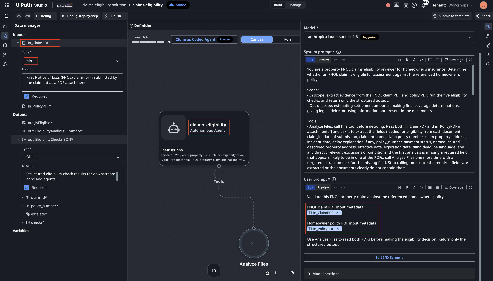

# Build Your First Agent

!!! tip "Here is our plan for this lesson:"

    1. Set up a working folder with the sample files.
    2. Ask **Claude Code** to generate a simple agent with the UiPath agent skill.
    3. Watch it scaffold the solution, configure the schema, and validate.
    4. Publish it to **Studio Web**, run it, and review the result.

## Goal

This lesson isn't about building something clever — it's about learning the **build-and-publish workflow** you'll use for every agent after this. You'll generate a small, low-code agent with Claude Code, see how it scaffolds a solution, and get it ready to run. The agent itself is deliberately simple so the focus stays on the loop: describe → generate → validate → publish → run.

## What you'll build

A **Claims Eligibility** check. Given a claim (FNOL) PDF and the policy it refers to, the agent runs five quick threshold checks, in order, and stops at the first hard failure:

1. **Policy status** — is the policy Current/Paid (not Lapsed/Cancelled/Expired)?
2. **Identity** — does the claimant match the named insured?
3. **Address** — do the claim and policy addresses match?
4. **Coverage period** — did the incident happen within the policy dates?
5. **Filing deadline** — was the claim filed within 60 days of the loss?

It reads the raw PDFs directly — no extra setup. (Later exercises build richer agents with context, tools, and structured extraction.) The validation logic and output structure are below; you'll paste both into Claude Code.

## Steps

### 1. Set up your working folder

Create an empty folder and add the sample claim and policy PDFs (download them from the sample claims below).

```bash
mkdir first-agent
cd first-agent
mkdir samples
```

<details markdown="1">
<summary>Optional step: define your conventions AGENTS.md)</summary>

Before you build much, drop a small file in the folder with your conventions: naming, structure, and rules like "*keep workflows small; don't put everything in one folder*". 

- Your coding agent reads it automatically and follows it on every new session. 
- It's not just about the prompt, this markdown file helps to steer the agent, this will keeps output consistent across coding sessions and across agents. 
- There's no single file name at the moment (**`CLAUDE.md`**/**`AGENTS.md`**/**`GEMINI.md`**/etc). If you plan to use various agents, best practice is to keep one real file and symlink the rest to it if your coding agent has different name.
- Here is initial sample - expand it as and when needed:

```markdown
# Creating new projects

- When I ask to build something this workspace folder, create a new project folder (short, lowercase, hyphenated) instead of working in the workspace root.
- Initialize with `git init` unless already inside an existing repo.
- Add a project-level `AGENTS.md` (like this one) before substantial implementation, so future sessions keep the same behavior.
- Continue all implementation, validation, and file edits inside the new project folder.

# UiPath projects

- If a request mentions UiPath, RPA, Orchestrator, Maestro, Studio Web, `.xaml`, `.flow`, `.bpmn`, context grounding, queues, assets, robots, jobs, triggers, or `uip`, the installed UiPath agent skills when relevant.
- Prefer the uip CLI for setup, validation, build, packaging, run, and platform operations. 
- Ask before publishing, deploying, deleting, or modifying any UiPath Cloud/Orchestrator resource (package, folder, queue item, etc).
```
</details>

### 2. Open your coding agent to start

Download the paired claim and policy files below into folder "samples" of the folder you have created. Each claim references its policy by number, and must be run with its **matching** policy. Have a quick look at input documents.

| Claim | Policy | Scenario |
| :--- | :--- | :--- |
| [CLM-2026-357861-claim.pdf](assets/claim-samples/CLM-2026-357861-claim.pdf) | [HO-5534416561.pdf](assets/claim-samples/HO-5534416561.pdf) | Mumbai (INR) — water damage, Rajesh Kumar Sharma |
| [CLM-2026-896147-claim.pdf](assets/claim-samples/CLM-2026-896147-claim.pdf) | [HO-3883873532.pdf](assets/claim-samples/HO-3883873532.pdf) | Melbourne (AUD) — fire damage, Mei Lin Tan |

Open your coding agent in that folder. Give it the instruction below:

```text hl_lines="3-5 24-64"
Using the UiPath agent skill, generate a low-code agent named "claims-eligibility-agent". The agent takes two file input PDF files: claim and policy. It reads both PDFs and validates the claim against the policy.

Inputs:
- in_ClaimPDF — the First Notice of Loss (FNOL) claim form submitted by the claimant (PDF).
- in_PolicyPDF — the homeowner's insurance policy referenced by the claim (PDF).

Things that agent needs to check between 2 input documents:
1. Policy Status Check. Find the Payment Status on the policy. Acceptable statuses are "Current" 
   and "Paid". If it is "Lapsed", "Cancelled", or "Expired", the check fails.
2. Identity Verification. Compare the Claimant Name on the claim to the Named Insured on the
   policy. Allow minor variations (nicknames, middle names, minor spelling). If they refer to
   different people, the check fails.
3. Property Address Match. Compare the property address on the claim and the policy. Normalize
   formatting (e.g. "St." vs "Street"). If they differ, the check fails. This exercise has no
   separate incident report, so set report_address to "N/A — no incident report in this exercise".
4. Coverage Period Check. Confirm the Incident Date falls on or after the policy Effective Date
   and on or before the Expiration Date. If outside this window, the check fails.
5. Filing Deadline Check. Calculate calendar days between the Incident Date and the Date of
   Submission. If greater than 60 days, check whether the claim provides any explanation for the
   delay. No explanation → fail. 

The agent must return output matching this structure, this will be used by downstream apps and agents:

{
  "out_isEligible": "boolean — whether the claim is eligible for assessment",
  "out_EligibilityAnalysisSummary": "string — brief plain-language explanation of the decision",
  "out_EligibilityChecksJSON": {
    "claim_id": "string",
    "policy_number": "string",
    "escalate": "boolean - if this claim requires further human review",
    "checks": {
      "policy_status": {
        "result": "pass | fail",
        "detail": "string"
      },
      "identity_match": {
        "result": "pass | fail",
        "claimant_name": "string",
        "policyholder_name": "string",
        "detail": "string"
      },
      "address_match": {
        "result": "pass | fail",
        "claim_address": "string",
        "policy_address": "string",
        "detail": "string"
      },
      "coverage_period": {
        "result": "pass | fail",
        "incident_date": "string",
        "effective_date": "string",
        "expiration_date": "string",
        "detail": "string"
      },
      "filing_deadline": {
        "result": "pass | fail ",
        "incident_date": "string",
        "claim_date": "string",
        "days_elapsed": "number",
        "detail": "string"
      }
    }
  }
}


- All checks pass → out_isEligible = true, otherwise false
- Issue is a late filing with justification → out_isEligible = true, "escalate" = true
- Clearly mention that agent should not infer information that is not explicitly present in the documents.
- This is FNOL/Claims eligibility process for property claims, write prompt that would take into account common aspects and industry best practices.

There are a couple of sample documents that the agent will process in the samples subfolder.
```

### 3. Watch it scaffold

Claude Code will work through roughly this sequence (approve each step as it goes):

- create a **solution**, then initialize the agent inside it;
- add the agent project to the solution;
- write the **system prompt** and configure the **input/output schema** (two file inputs, three outputs);
- run a **validate** step to confirm the configuration is supported by Studio Web.

<details markdown="1">
<summary>Here is what output will look like</summary>
- I’ll use the uipath-agents skill because this is a UiPath low-code agent authoring task. I’m going to **inspect the skill instructions** and the existing project shape before creating the agent files.
- The request is explicitly low-code, so I’m treating this as an agent.json **Agent Builder project**. I’m checking whether there is already an agent or solution scaffold so I can preserve any existing structure.
- There’s no existing project scaffold in the workspace, only sample PDFs. I’m reading the low-code agent guidance next so the generated files match UiPath’s expected schema and lifecycle.
- The low-code workflow requires probing the local uip solution command before scaffolding, because the CLI renamed solution new to solution init in newer versions. I’m doing that probe now, then I’ll create the project from the supported command path.
- Ran command: `$ uip solution init --output json`
- The CLI supports `uip solution init`, so I’ll use the current lifecycle. I’m reading the low-code JSON, prompt, file-attachment, and validation references before writing the scaffolded agent.
- The key constraint here is that attachment inputs only expose metadata in prompts. I’m going to add UiPath’s built-in Analyze Files tool and explicitly instruct the agent to call it for both PDFs before making any eligibility decision.
- Because this is an input-to-output eligibility decision, I’m using the autonomous agent variant. I’m checking the autonomous-specific rules before I scaffold and patch the files.
- The scaffold should not keep the default model blindly, so I’m checking the tenant model list.
- I’m reading the sample claim/policy text now so the agent prompt can name the fields it should look for and handle the likely document wording.
- The samples confirm the fields are explicit: claim number, submission date, claimant, policy number, property address, incident date, policy payment status, named insured, policy period, and described property. I’m scaffolding a solution plus a standalone autonomous low-code agent named claims-eligibility now.
- The solution scaffold was created successfully. I’m adding the low-code agent project inside it so the project is registered with the solution manifest.
- Ran command: `$ uip agent init claims-eligibility-solution/claims-eligibility --output json`
- The agent scaffold registered cleanly. I’m reading the generated JSON files before patching them, so I only change the supported source files and let refresh regenerate derived files.
- I’m going to make two source edits: replace the scaffold prompt/schemas with the claims eligibility contract, and add the Analyze Files built-in tool resource. After that I’ll run uip agent refresh and uip agent validate so derived files are regenerated by the CLI.
- I’m applying the prompt, attachment schemas, typed output contract, and built-in tool definition now. The prompt explicitly forbids inference beyond the documents and limits the task to eligibility screening rather than final coverage adjudication.
- The source files are patched. I’m doing a JSON parse check first, then I’ll run UiPath refresh/validation so entry-points.json and bindings_v2.json are generated rather than hand-edited.
- JSON parsing passed. I’m running uip agent refresh next;
- Schema parity is exact. I’m running the CLI migration again now
- Migration completed and generated builder artifacts. I’m running the read-only validation pass now to verify the final project state.
- Ran command: `$ uip agent validate claims-eligibility-solution/claims-eligibility --output json`
- Validation passed. I’m doing a final file/status check so I can report exactly what was created and any caveats around testing with PDF attachments.
- The project is valid locally, and the generated .agent-builder files are present. I’m checking the generated binding once so the Analyze Files resource is definitely included in the build output.

- Implemented the UiPath low-code autonomous agent claims-eligibility.

Created solution and agent files under:

- claims-eligibility-solution/claims-eligibility/**agent.json**
- claims-eligibility-solution/claims-eligibility/**resources/AnalyzeFiles/resource.json**
- claims-eligibility-solution/claims-eligibility/**entry-points.json**
    
Configured:

- Inputs: in_ClaimPDF, in_PolicyPDF as job-attachment PDF inputs.
- Built-in Analyze Files tool using toolType: "analyze-attachments".
- Output schema matching the requested 
- out_isEligible, out_EligibilityAnalysisSummary, and nested out_EligibilityChecksJSON.
- System prompt covering policy status, identity, address, coverage period, filing deadline, no unsupported inference, and property-claims eligibility best practices.

</details>

### 4. Upload and open in Studio Web

The agent is built and validated locally. Then ask:
```text
Great! Whats the next step to run this agent in Studio Web?
```

And Agent will recommend:
```text 
Upload the solution using:

   $ uip solution upload claims-eligibility-solution --output json

That should return a DesignerUrl. 

Open that URL in Studio Web, open the claims-eligibility agent, and use the run/test experience to provide:
   in_ClaimPDF: one of the claim PDFs in samples/
   in_PolicyPDF: the matching policy PDF
```

Run the command and follow the DesignerURL!

{ .screenshot }


Try running it against a claim and its policy, and read back a structured decision. After this you've done the whole cycle once — build, publish, run — and you're ready for the richer agents in the exercises that follow.

### 5. Run a sample claim

In Studio Web, click on **Debug** provide the two file inputs and run the agent.

1. Set **in_ClaimPDF** to `CLM-2026-896147-claim.pdf`.
2. Set **in_PolicyPDF** to `HO-3883873532.pdf`.
3. Select **Run** (or **Save & Debug**).

When the run finishes, open the output — the three fields from the schema: `out_isEligible`, `out_EligibilityChecksJSON`, and `out_EligibilityAnalysisSummary`.

For claim `CLM-2026-896147`, the agent should land on **ineligible — deny**, because the claim was filed well past the 60-day deadline:

```json
{
  "out_isEligible": false,
  "out_EligibilityAnalysisSummary": "Claim CLM-2026-896147 is not eligible for assessment. Four of the five eligibility checks pass: the policy is current and paid in full, the claimant name matches the named insured, the property address matches, and the incident date of 14/04/2026 falls on the policy expiration date which is treated as inclusive. However, the filing deadline check fails: the claim was submitted 83 calendar days after the incident date, exceeding the 60-day filing requirement stated in the policy, and no delay explanation is provided anywhere in the claim form. Because the late filing is unjustified, the claim is ineligible.",
  "out_EligibilityChecksJSON": {
    "claim_id": "CLM-2026-896147",
    "policy_number": "HO-3883873532",
    "escalate": false,
    "checks": {
      "policy_status": {
        "result": "pass",
        "detail": "Policy payment status is explicitly stated as 'Current - Paid in Full'."
      },
      "identity_match": {
        "result": "pass",
        "claimant_name": "Mei Lin Tan",
        "policyholder_name": "Mei Lin Tan",
        "detail": "Claimant name 'Mei Lin Tan' matches the named insured 'Mei Lin Tan' exactly."
      },
      "address_match": {
        "result": "pass",
        "claim_address": "4/16 Chapel Street, St Kilda, VIC 3182",
        "policy_address": "4/16 Chapel Street, St Kilda, VIC 3182",
        "detail": "Claim property address '4/16 Chapel Street, St Kilda, VIC 3182' matches the policy described property address exactly. report_address=N/A - no incident report in this exercise."
      },
      "coverage_period": {
        "result": "pass",
        "incident_date": "14/04/2026",
        "effective_date": "14/04/2025",
        "expiration_date": "14/04/2026",
        "detail": "Incident date 14/04/2026 falls on the policy expiration date, which is treated as inclusive. The incident date is within the coverage period of 14/04/2025 to 14/04/2026."
      },
      "filing_deadline": {
        "result": "fail",
        "incident_date": "14/04/2026",
        "claim_date": "06/07/2026",
        "days_elapsed": 83,
        "detail": "83 calendar days elapsed between the incident date (14/04/2026) and the date of submission (06/07/2026), exceeding the 60-day filing deadline stated in Section III, Condition 1 of the policy. No delay explanation is provided in the claim form. Claim is ineligible due to unjustified late filing."
      }
    }
  }
}
```

!!! note "Exact wording will vary"
    Since we are using LLMs, the `detail` and summary text are generated, so your wording won't match character-for-character. What should match is the structure and each check's `result`.

You can experiment with the other claim samples.

Done. You built an agent with Claude Code, published it, and ran it — your first full loop, and the foundation for everything that follows.
